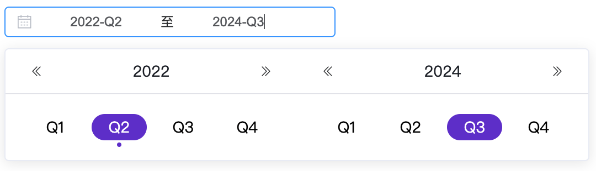
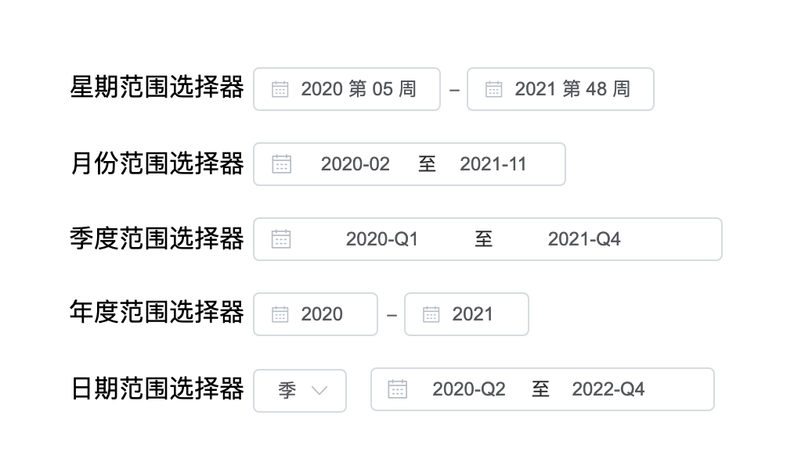

# mo-quarter-picker

一个基于 Vue2 和 ElementUI 的季节范围选择器



- Home: [https://mouday.github.io/mo-quarter-picker/](https://mouday.github.io/mo-quarter-picker/)
- NPM: [https://www.npmjs.com/package/mo-quarter-picker](https://www.npmjs.com/package/mo-quarter-picker)
- Github: [https://github.com/mouday/mo-quarter-picker](https://github.com/mouday/mo-quarter-picker)

element-ui没有季节范围选择器，而字节跳动开源的UI库[arco.design](https://arco.design/vue/component/date-picker)，只支持Vue3，奈何老项目是Vue2的，只能自己动手了

用到的第三方库

- Vue2.js [https://cn.vuejs.org/v2/guide/](https://cn.vuejs.org/v2/guide/)

- element-ui [https://element.eleme.cn/#/zh-CN/component/installation](https://element.eleme.cn/#/zh-CN/component/installation)

- momentjs [http://momentjs.cn/](http://momentjs.cn/)

在线 demo: [https://mouday.github.io/mo-quarter-picker/test.html](https://mouday.github.io/mo-quarter-picker/test.html)

## 方式一：CDN 引入

[https://cdn.jsdelivr.net/npm/mo-quarter-picker/](https://cdn.jsdelivr.net/npm/mo-quarter-picker/)

```html
<script src="https://mouday.github.io/mo-quarter-picker/dist/mo-quarter-picker.min.js"></script>
```

Hello world

```html
<!DOCTYPE html>
<html lang="en">
  <head>
    <meta charset="utf-8" />
    <title>mo-quarter-picker</title>
    <!-- element-ui样式 -->
    <link
      href="https://cdn.bootcdn.net/ajax/libs/element-ui/2.15.8/theme-chalk/index.min.css"
      rel="stylesheet"
    />
  </head>

  <body>
    <h1>
      季节范围选择器：mo-quarter-picker
    </h1>

    <div id="app">
      <mo-quarter-picker
        :value.sync="value"
        @on-change="handleChange"
      ></mo-quarter-picker>
    </div>

    <!-- 引入依赖 -->
    <script src="https://cdn.bootcss.com/vue/2.6.10/vue.min.js"></script>
    <script src="https://cdn.bootcdn.net/ajax/libs/element-ui/2.15.8/index.min.js"></script>
    <script src="https://cdn.bootcdn.net/ajax/libs/moment.js/2.29.2/moment.min.js"></script>

    <script src="https://mouday.github.io/mo-quarter-picker/dist/mo-quarter-picker.min.js"></script>

    <script>
      const app = new Vue({
        el: "#app",
        data() {
          return {
            value: null
          };
        },

        methods: {
          handleChange(value) {
            console.log(value);
          }
        }
      });
    </script>
  </body>
</html>
```

## 方式二：NPM

```
npm i mo-quarter-picker -S
```

main.js

```js
import Vue from "vue";
import App from "./App.vue";

import ElementUI from "element-ui";
import "element-ui/lib/theme-chalk/index.css";
import MoQuarterPicker from "mo-quarter-picker";

Vue.use(ElementUI);
Vue.use(MoQuarterPicker);

new Vue({
  el: "#app",
  render: h => h(App)
});
```

## 参数

| 参数  | 说明   | 类型  | 可选值                                   | 默认值 |
| ----- | ------ | ----- | ---------------------------------------- | ------ |
| value | 当前值 | Array | null，例如：['2022-07-01', '2024-06-30']支持`sync` | null   |

## 事件

| 事件名称  | 说明                   | 回调参数 |
| --------- | ---------------------- | -------- |
| on-change | 用户修改选定的值时触发 | data     |

on-change 回调参数 data：

```js
[
  {
    end_date: "2022-09-30"
    label: "Q3"
    quarter: 3
    start_date: "2022-07-01"
    value: "2022-3"
    year: 2022
  },
  {
    end_date: "2024-06-30"
    label: "Q2"
    quarter: 2
    start_date: "2022-04-01"
    value: "2023-2"
    year: 2023
  }
]
```

自定义颜色

```less
:root{
  --primary-color: #6833cf;
}

// 季节选择器
// 选中季节的背景色
.quarter-picker__item--active .quarter-picker__item__label,
.quarter-picker__item:hover .quarter-picker__item__label {
  background-color: var(--primary-color) !important;
}

// 当前季节下的小圆点
.quarter-picker__item__today:after {
  background-color: var(--primary-color) !important;
}
```

## mo-quarter-picker 2.0



增加 周、月、季度、年范围选择器

新增组件

```html
mo-date-range-picker
mo-week-range-picker
mo-month-range-picker
mo-year-range-picker
```

修改组件名

```html
mo-quarter-picker => mo-quarter-range-picker
```

示例：

```html
<!-- 月份 -->
<mo-month-range-picker
      :value.sync="value"
      @on-change="handleChange"
  >
</mo-month-range-picker>

<!-- 星期 -->
<mo-week-range-picker
      :value.sync="value"
      @on-change="handleChange">
</mo-week-range-picker>

<!-- 年度 -->
<mo-year-range-picker 
        :value.sync="value"
        @on-change="handleChange">
      </mo-year-range-picker>

<!-- 日期范围选择器 -->
<mo-date-range-picker 
      :type.sync="type"
      :week-value.sync="week_value"
      :month-value.sync="month_value"
      :quarter-value.sync="quarter_value"
      :year-value.sync="year_value"
      @on-value-change="handleValueChange"
      @on-type-change="handleTypeChange"
    ></mo-date-range-picker>
```